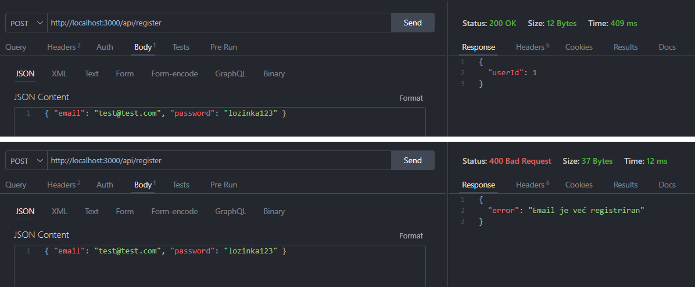
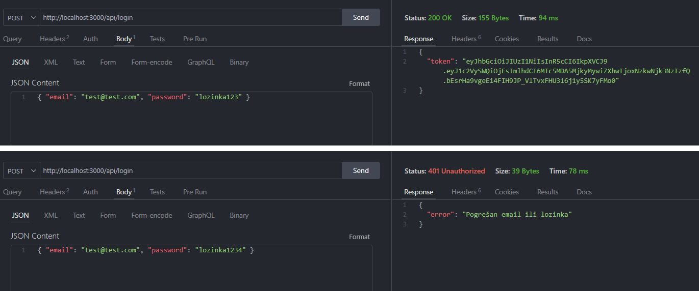
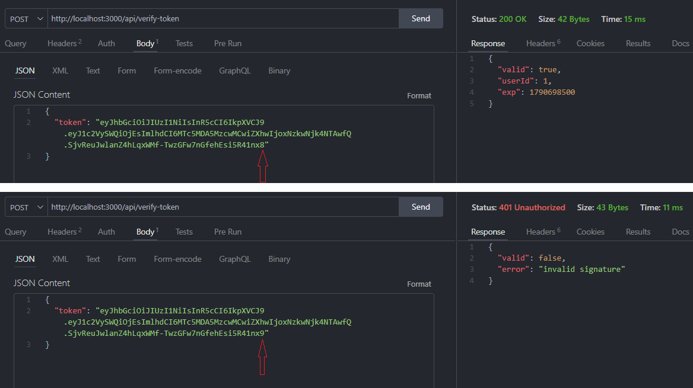
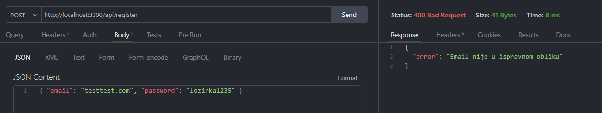

# Tjedan 2, Dan 5 – Detaljni plan: Registracija i login

## bcrypt:

- Nikad ne spremaj čiste lozinke
- Hash je jednosmjeran (ne možeš iz hasha dobiti lozinku natrag)
- bcrypt je namjerno spor (otežava brute-force napade)
- Salt je automatski ugrađen u hash (isti input → različiti hashovi)
- `bcrypt.hash(lozinka, 10)` → hash, 10 = cost factor, koliko puta bcrypt ponovi proces
- `bcrypt.compare(unos, hash)` → true/false

## JWT:

- Nije šifriran, samo potpisan (bilo tko može pročitati sadržaj)
- Nikad ne stavljaj osjetljive podatke u JWT (samo `userId` je dovoljno)
- Server ne pamti session (stateless)
- `jwt.sign({ userId }, SECRET, { expiresIn: '7d' })` → token
- `jwt.verify(token, SECRET)` → `{ userId }` ili greška
- `JWT_SECRET` ide u `.env` (nikad u kod!)

---





Nakon unošenja tokena vidljiv je userId:

**Decoded Payload**

```json
{
  "userId": 1,
  "iat": 1790092923,
  "exp": 1790697723
}
```

---

## Vježbe

### 1. Registriraj se, prijavi se, dekodiraj token na jwt.io

Promijeni JEDAN znak u tom tokenu (bilo gdje) i pokušaj ga provjeriti — možeš to simulirati tako da u kodu privremeno pozoveš `jwt.verify` na izmijenjenom tokenu i vidiš da baci grešku.



---

### 2. Email validacija

U `/api/register`, trenutno ne provjeravamo je li email uopće u ispravnom obliku (npr. "nešto" bez @ prolazi). Dodaj jednostavnu provjeru — `email.includes('@')` je dovoljno za danas, ne treba prava regex validacija.



---

### 3. (Bez koda) Što bi se dogodilo tvojim korisnicima kad bi backend server ugasio i ponovno pokrenuo?

Danas koristim `const users = []` u memoriji jer mi je fokus na testiranju autentifikacijske logike. Kad prijeđem na produkciju, trebat će prava baza — vjerojatno PostgreSQL — da podaci ostanu trajno spremljeni.

---

### 4. (Stretch) console.log decoded tokena

```
PS C:\Users\Ivan\training-tracker-backend> node .\index.js
◇ injected env (1) from .env
Server running on port 3000
Token payload: { userId: 1, iat: 1790094527, exp: 1790699327 }
Očekivani userId: 1
Poklapa se: true
```